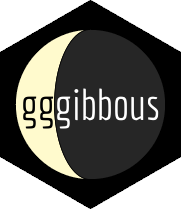

```{r, include = FALSE}
knitr::opts_chunk$set(
  collapse = TRUE,
  comment = "#>",
  fig.path = "man/figures/README-",
  out.width = "100%"
)
```

# gggibbous

Moon charts, a pie chart alternative for two groups in ggplot2



## Installation

`gggibbous` is not yet on CRAN, so the easiest way to install it is with the `devtools` package:

```{r, eval = FALSE}
devtools::install_github("mnbram/gggibbous")
```

```{r, child = 'vignettes/gggibbous.Rmd'}
```