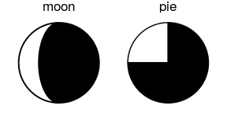
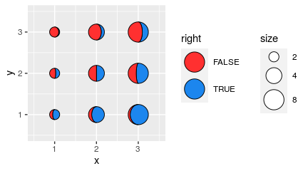
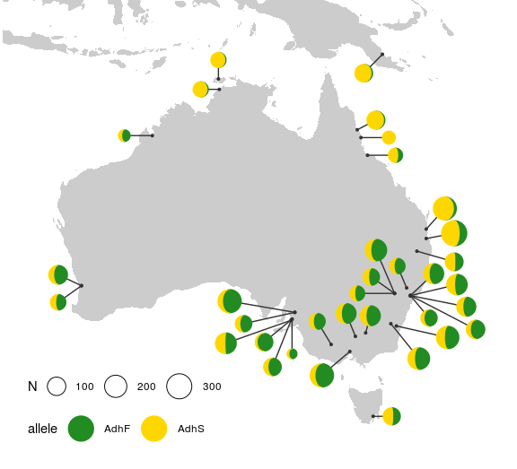

# gggibbous

Moon charts, a pie chart alternative for two groups in ggplot2


## Installation

`gggibbous` is not yet on CRAN, so the easiest way to install it is with
the `devtools` package:

``` r
devtools::install_github("mnbram/gggibbous")
```

## Moon charts and pie charts

A pie chart divides a circle into multiple sections where the arc
lengths (and so also the areas) of the sections represent proportions of
a whole. A moon chart, similarly, divides a circle into sections where
the areas represent proportions of a whole, but in a moon chart the
areas are drawn as crescent or gibbous portions of a circle—like the
phases of the moon.

<!-- -->

The motivation behind using a moon chart instead of a pie chart is
primarily one of aesthetic choice. Note also that because the sections
of a moon chart are swept from one or the other side of the circle, they
are generally only appropriate for depicting one or two groups.

## `gggibbous` and its usage

`gggibbous` extends the `ggplot2` data visualization package to provide
support for moon charts in R. Unlike the pie charts supported natively
by `coord_polar()` in R, moon charts in `gggibbous` do not require any
special coordinate system. They are drawn most similarly to points in
`ggplot2`: their position is defined by an `x` and a `y` coordinate and
their size is defined independently of the coordinate system, so they
always remain circular.

``` r
library(gggibbous)
#> Loading required package: ggplot2
```

``` r
ggplot(data.frame(x = 1:5, y = 1, size = 2^(0:4)), aes(x, y, size = size)) +
  geom_moon() +
  geom_point(y = 2) +
  lims(x = c(0.5, 5.5), y = c(0.5, 2.5)) +
  scale_size(range = c(5, 10))
```

<!-- -->

Two new aesthetics are also important in `geom_moon`: `ratio` and
`right`.

### The `ratio` aesthetic

`ratio` controls the proportion of the moon to be drawn. It should be
between 0 (a “new moon” where nothing is actually drawn) and 1 (a “full
moon”, i.e. a
circle).

``` r
ggplot(data.frame(x = 1:5, y = 0, ratio = 0:4 * 0.25), aes(x = x, y = y)) +
  geom_moon(aes(ratio = ratio), size = 20, fill = "black") +
  geom_text(aes(y = y + 1, label = ratio)) +
  lims(x = c(0.5, 5.5), y = c(-1, 1.4)) +
  theme_void()
```

<!-- -->

### The `right` aesthetic

`right` takes a boolean value that controls whether the moon is “waxing”
or “waning”—that is, whether it is “filled” from the right or the left.

One way to make a “complete” moon with two colors is to use `right =
TRUE` for one color and `right = FALSE` for the other, with
complementary ratios. (See the examples below for some other
approaches.)

``` r
tidymoons <- data.frame(
  x = rep(1:3, 6),
  y = rep(rep(3:1, each = 3), 2),
  ratio = c(1:9 / 10, 9:1 / 10),
  right = rep(c(TRUE, FALSE), each = 9)
)

ggplot(tidymoons) +
  geom_moon(aes(x, y, ratio = ratio, right = right, fill = right)) +
  lims(x = c(0.5, 3.5), y = c(0.5, 3.5))
```

<!-- -->

## Legend key glyphs

`gggibbous` includes three key glyphs for different types of legends:
`draw_key_moon`, `draw_key_moon_left`, and `draw_key_full_moon`

**`draw_key_moon`**—the default in `geom_moon`—draws a gibbous moon (see
above).

**`draw_key_moon_left`** draws a crescent moon from the left that is
complementary to the gibbous moon in `draw_key_moon`, which is useful
for combined legends:

``` r
ggplot(tidymoons, aes(x, y, ratio = ratio, right = right, size = 2^x)) +
  geom_moon(data = subset(tidymoons, right), fill = "violetred") +
  geom_moon(
    data = subset(tidymoons, !right), fill = "turquoise3",
    key_glyph = draw_key_moon_left
  ) +
  lims(x = c(0.5, 3.5), y = c(0.5, 3.5)) +
  scale_size("size", range = c(5, 10), breaks = 2^(1:3))
```

<!-- -->

**`draw_key_full_moon`** draws a circle. It is similar to the “point”
key glyph, but the size is calculated slightly differently, so it is
more appropriate if you want the size of legend moons and the size of
the plot moons to match.

``` r
ggplot(tidymoons) +
  geom_moon(
    aes(x, y, ratio = ratio, right = right, fill = right, size = 2^x),
    key_glyph = draw_key_full_moon
  ) +
  lims(x = c(0.5, 3.5), y = c(0.5, 3.5)) +
  scale_size("size", range = c(5, 10), breaks = 2^(1:3)) +
  scale_fill_manual(values = c("firebrick1", "dodgerblue2")) +
  theme(legend.box = "horizontal")
```

<!-- -->

## Worked examples

### Moon charts on maps

One common use of multiple pie charts is to represent proportions at
different coordinates on a map. The *x* and *y* dimensions are already
committed to the map coordinates, so proportional visualizations like
bar charts are more difficult. This is a perfect opportunity to try out
moon charts\!

Pie chart maps are popular in population genetics, so let’s look at an
example from that field. The `dmeladh` data\[1\] contains frequencies of
two variants of the *Adh* gene in Australian and Papua New Guinean fruit
fly populations. Many of these populations are close together, so we
have to deal with overplotting, which we do manually below.

``` r
dmeladh_adj <- dmeladh
dmeladh_adj$long <- dmeladh$Longitude + c(
  -2, 0, -2, 2, -3, 3, 3, 2, 3, 4, -2.5, -2.5, -1, -2, -2.5, -4, 2.5,
  5, 6, 7, 2, -7, -5.5, -3, 0, -7, -2, 3, 5.5, 0.5, -1, -1.5, -3, 2)
dmeladh_adj$lat <- dmeladh$Latitude + c(
  -2, 2, 0, 1, 0, 0, 0, 2, 0.5, -1, 1, -1.5, 2, 4, 1.5, 0, 2,
  1, -1, -3, -2, 1, -1, -2, -3, -2, -4, -3, -1, 1.5, 2, 2, -2, 0)

moonmap <- ggplot(dmeladh_adj, aes(long, lat)) +
  geom_polygon(
    data = map_data(
      "world", region = "(Australia)|(Indonesia)|(Papua New Guinea)"),
    aes(group = group),
    fill = "gray80"
  ) +
  geom_segment(aes(xend = Longitude, yend = Latitude), color = "gray20") +
  geom_point(aes(Longitude, Latitude), size = 0.75, color = "gray20") +
  scale_size(range = c(4, 10)) +
  coord_map(xlim = c(110, 160), ylim = c(-45, -5)) +
  theme_void() +
  theme(
    legend.position = c(0.05, 0.05),
    legend.direction = "horizontal",
    legend.justification = c(0, 0)
  )

moonmap +
  geom_moon(
    aes(ratio = AdhS / 100, size = N),
    right = FALSE, fill = "gold", color = "gold",
    key_glyph = draw_key_moon_left
  ) +
  geom_moon(
    aes(ratio = AdhF / 100, size = N),
    fill = "forestgreen", color = "forestgreen"
  )
```

<!-- -->

If we want to label the alleles in the legend explicitly, then we need
to map them to a group, which requires that we rearrange the data into a
“longer” (“tidy”) format.

``` r
tidyadh <- reshape(
  dmeladh_adj,
  varying = c("AdhF", "AdhS"),
  v.names = "percent",
  timevar = "allele",
  times = c("AdhF", "AdhS"),
  idvar = c("Locality", "Latitude", "Longitude", "long", "lat", "N"),
  direction = "long"
)
tidyadh$right <- rep(c(TRUE, FALSE), each = nrow(dmeladh_adj))

moonmap +
  geom_moon(
    data = tidyadh, key_glyph = draw_key_full_moon,
    aes(ratio = percent / 100, fill = allele, color = allele, right = right,
        size = N)
  ) +
  scale_fill_manual(values = c("forestgreen", "gold")) +
  scale_color_manual(values = c("forestgreen", "gold"))
```

<!-- -->

### Lunar data

Sometimes you just want to plot literal representations of the moon. The
`lunardist` data, adapted from NASA, contains the distance from the
Earth to the Moon for each day in 2019, as well as the dates (in UTC) of
each occurrence of the four principal phases of the moon. We can plot
those principal phases using moon charts (which in this case are
identical to pie charts).

``` r
moonphase <- subset(lunardist, !is.na(phase))
moonphase$percent <- ifelse(
  moonphase$phase == "new", 0, ifelse(moonphase$phase == "full", 1, 0.5))

ggplot(lunardist, aes(date, distance)) +
  geom_line() +
  # Plotting the lower layer as a full circle also works in most cases
  geom_moon(data = moonphase, ratio = 1, size = 5, fill = "black") +
  geom_moon(
    data = moonphase, aes(ratio = percent),
    size = 5, fill = "yellow", right = moonphase$phase == "first quarter"
  )
```

<!-- -->

### Harvey balls

“Harvey balls” are essentially pie charts used for qualitative
comparisons, often in tabular format. We can use moon charts for the
same purpose.

First, let’s make up some data:

``` r
rest_names <- c(
  "Anscombe's Luncheonette", "Chai Squared", "Tukey's Honest Southern Diner",
  "Bagels ANOVA", "Spearmint Row"
)
restaurants <- data.frame(
  Restaurant = factor(rest_names, levels = rest_names),
  Food = c(5, 3, 4, 4, 1),
  Decor = c(2, 5, 3, 1, 5),
  Service = c(4, 2, 3, 3, 5),
  Price = c(4, 5, 2, 5, 2)
)
```

As a regular table:

| Restaurant                    | Food | Decor | Service | Price |
| :---------------------------- | :--: | :---: | :-----: | :---: |
| Anscombe’s Luncheonette       |  5   |   2   |    4    |   4   |
| Chai Squared                  |  3   |   5   |    2    |   5   |
| Tukey’s Honest Southern Diner |  4   |   3   |    3    |   2   |
| Bagels ANOVA                  |  4   |   1   |    3    |   5   |
| Spearmint Row                 |  1   |   5   |    5    |   2   |

And now as a table with Harvey moons:

``` r
# First we reshape the data into "long" format to facilitate plotting
rest_cats <- c("Food", "Decor", "Service", "Price")
tidyrest <- reshape(
  restaurants,
  varying = rest_cats,
  v.names = "Score",
  timevar = "Category",
  times = factor(rest_cats, levels = rest_cats),
  idvar = "Restaurant",
  direction = "long"
)

ggplot(tidyrest, aes(0, 0)) +
  geom_moon(aes(ratio = (Score - 1) / 4), fill = "black") +
  geom_moon(aes(ratio = 1 - (Score - 1) / 4), right = FALSE) +
  facet_grid(Restaurant ~ Category, switch = "y") +
  theme_minimal() +
  theme(
    panel.grid = element_blank(),
    strip.text.y = element_text(angle = 180, hjust = 1),
    axis.text = element_blank(),
    axis.title = element_blank()
  )
```

<!-- -->

1.  Oakeshott, J.G., et al. 1982. Alcohol dehydrogenase and
    glycerol-3-phosphate dehydrogenase clines in *Drosophila
    melanogaster* on different continents. Evolution, 36(1): 86-96.
